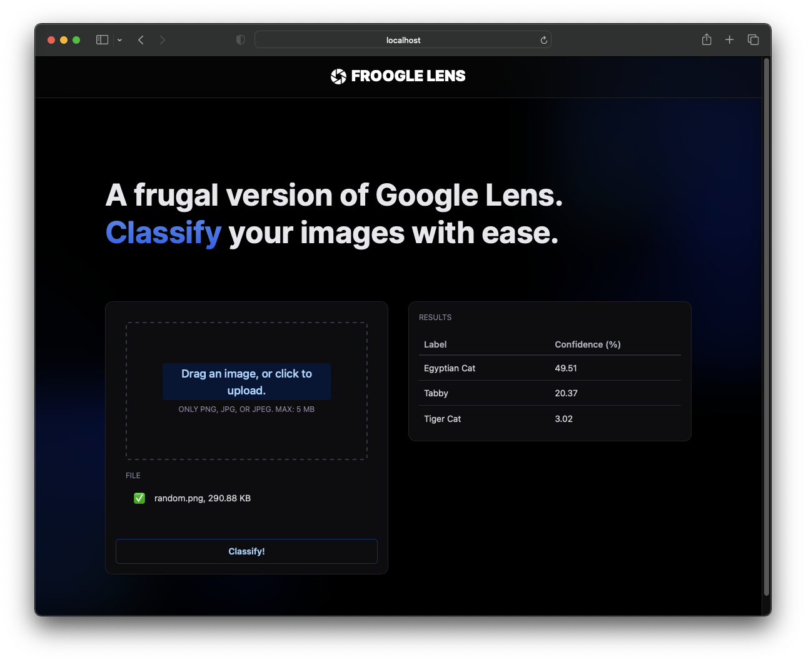
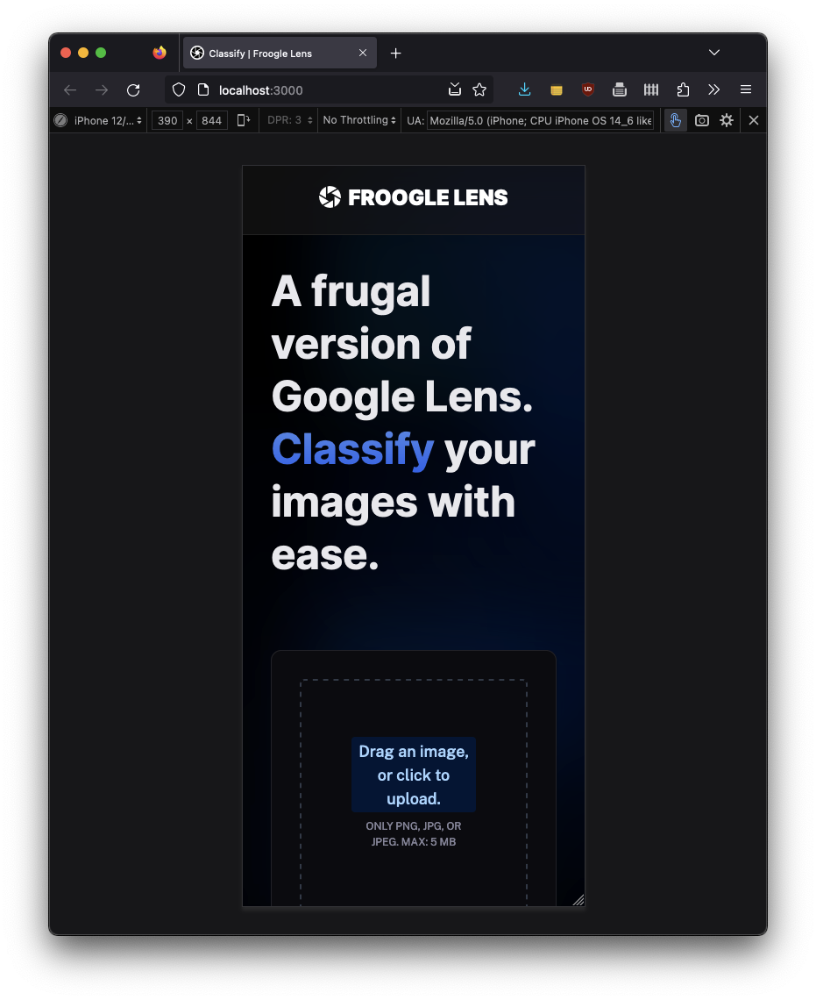

# Froogle Lens Web App

Froogle Lens is a web app that allows users to upload images and perform image classification using a pre-trained MobileNetV2 model. It provides an intuitive and responsive interface for users to classify images and view the top 3 predicted labels along with their confidence percentages.

## Features

- Image Upload: Users can drag and drop an image or click to upload it for classification.
- Image Classification: The uploaded image is processed and classified using the MobileNetV2 model.
- Top 3 Predictions: The app displays the top 3 predicted labels with their confidence percentages.
- Real-time Updates: The app periodically updates the classification results every 5 seconds.

## Technologies Used

- Frontend:

  - Next.js 13
  - TypeScript
  - Tailwind CSS
  - Material UI

- Backend:
  - Flask (Python, use 3.8.9 or above)
  - TensorFlow
  - Redis

## How to Use (Setup/Build)

1. Clone the repository:

   `git clone https://github.com/yourusername/froogle-lens.git`

2. Install dependencies for frontend:

   Run `npm install` at the root of the project

3. Install dependencies for backend:

   > Optional: Create a virtual environment using,
   >
   > `cd api`
   >
   > `python3 -m venv venv`
   >
   > Activate virtual environment: `source venv/bin/activate`

   Run while in `api` folder:

   `pip install -r requirements.txt`

   Important: Tested with Python 3.8.9 and above. Make sure you have the appropriate Python version!

4. Configure `.env` file:

   Create a `.env` file at the root of the project, and set `REDIS_URL=<your_redis_connection_string>`.
   Or use the connection string I provided in an email, if applicable.

   For more information about setting Redis up, see [Redis Cloud](https://app.redislabs.com/).

## Start Frontend and Backend

At root of project, run:

### - Frontend

`npm run dev`

### - Backend

`npm run start-api`

...and that's it! The app should be running at [http://localhost:3000](http://localhost:3000) now.

## Screenshots

App desktop view for wide displays:

App responsive view for narrow displays:

## Contributing

I welcome contributions to Froogle Lens! If you find a bug or have an enhancement in mind, please open an issue or submit a pull request.

## License

This project is licensed under the [MIT License](LICENSE.md).

## Acknowledgments

- The MobileNetV2 model used in this project is provided by TensorFlow and is pre-trained on the ImageNet dataset.
- Special thanks to the creators of Next.js, Tailwind CSS, Material UI, and Flask for their excellent frameworks and libraries.
